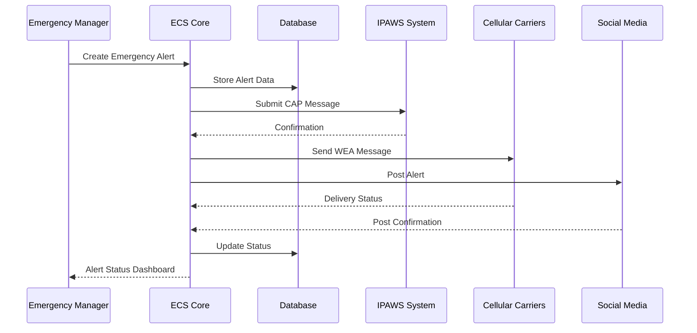
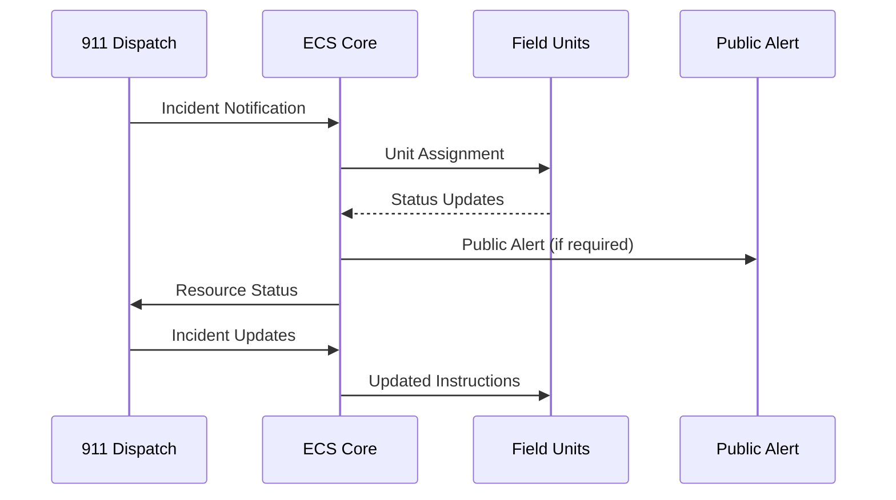

# Interface Control Document
## Emergency Communication System v2.1

**Document Version:** 2.1  
**Date:** January 15, 2025  
**Prepared for:** Metropolitan Emergency Management Agency  
**Classification:** For Official Use Only  

---

## 1. Introduction

### 1.1 Purpose
This Interface Control Document (ICD) defines the external and internal interfaces for the Emergency Communication System (ECS) v2.1. This document specifies data formats, communication protocols, timing requirements, and interface specifications required for system integration.

### 1.2 Scope
This ICD covers all interfaces between ECS components and external systems including government agencies, telecommunications providers, public safety networks, and citizen notification platforms.

---

## 2. External System Interfaces

### 2.1 IPAWS Interface (Federal Emergency Management Agency)

**Interface ID:** EXT-IPAWS-001  
**Protocol:** HTTPS REST API with SOAP fallback  
**Data Format:** Common Alerting Protocol (CAP) 1.2 XML  
**Authentication:** X.509 digital certificates with FIPS 140-2 Level 3 compliance  

**Message Flow:**
- **Outbound:** ECS → IPAWS alert submission
- **Inbound:** IPAWS → ECS alert relay and status updates

**Data Elements:**
```xml
<alert xmlns="urn:oasis:names:tc:emergency:cap:1.2">
  <identifier>ECS-METRO-2025-001234</identifier>
  <sender>metro.emergency@cityname.gov</sender>
  <sent>2025-01-15T10:30:00-05:00</sent>
  <status>Actual|Exercise|System|Test|Draft</status>
  <msgType>Alert|Update|Cancel|Ack|Error</msgType>
  <scope>Public|Restricted|Private</scope>
  <info>
    <language>en-US</language>
    <category>Safety|Security|Rescue|Fire|Health|Env|Transport|Infra|CBRNE|Other</category>
    <event>Emergency Event Description</event>
    <urgency>Immediate|Expected|Future|Past|Unknown</urgency>
    <severity>Extreme|Severe|Moderate|Minor|Unknown</severity>
    <certainty>Observed|Likely|Possible|Unlikely|Unknown</certainty>
    <area>
      <areaDesc>Geographic area description</areaDesc>
      <polygon>38.847,-77.040 38.847,-77.020 38.837,-77.020 38.837,-77.040 38.847,-77.040</polygon>
    </area>
  </info>
</alert>
```

**Timing Requirements:**
- Alert submission response: < 5 seconds
- Status update frequency: Every 30 seconds during active alerts
- Connection timeout: 30 seconds
- Retry attempts: 3 with exponential backoff

### 2.2 911 Dispatch System Interface

**Interface ID:** EXT-911-001  
**Protocol:** NENA i3 Standard with SIP/HTTP  
**Data Format:** XML over HTTP with JSON fallback  
**Authentication:** TLS client certificates with role-based access  

**Message Types:**
1. **Incident Notification**
   - New incident creation
   - Incident status updates
   - Resource assignments
   - Incident closure

2. **Location Services**
   - Caller location queries
   - Geospatial data requests
   - Address validation

3. **Unit Status Updates**
   - Available/Busy/Out of Service
   - GPS location updates
   - Response assignments

**Sample Message Format:**
```json
{
  "messageType": "incidentNotification",
  "timestamp": "2025-01-15T10:30:00Z",
  "incidentId": "INC-2025-001234",
  "incidentType": "MEDICAL_EMERGENCY",
  "location": {
    "latitude": 38.847263,
    "longitude": -77.040040,
    "address": "123 Main Street, Anytown, State 12345",
    "confidence": 95
  },
  "priority": "HIGH",
  "units": ["AMB-01", "ENG-07", "MEDIC-12"],
  "description": "Chest pain, conscious and breathing"
}
```

### 2.3 National Weather Service Interface

**Interface ID:** EXT-NWS-001  
**Protocol:** HTTPS REST API  
**Data Format:** JSON with XML fallback  
**Authentication:** API key with rate limiting  

**Endpoints:**
- `/alerts/active` - Active weather alerts
- `/forecast/hourly` - Hourly forecast data
- `/observations/current` - Current weather observations
- `/warnings/severe` - Severe weather warnings

**Data Refresh Rates:**
- Current conditions: Every 5 minutes
- Forecasts: Every hour
- Alerts/Warnings: Real-time push notifications via WebSocket

### 2.4 Cellular Carrier Interfaces

**Interface ID:** EXT-CELL-001, EXT-CELL-002, EXT-CELL-003  
**Protocol:** Cell Broadcast Entity (CBE) API  
**Data Format:** Wireless Emergency Alert (WEA) format  
**Authentication:** Mutual TLS with carrier-specific certificates  

**Supported Carriers:**
- Verizon Wireless (Primary)
- AT&T (Primary)
- T-Mobile (Primary)
- Regional carriers (Secondary)

**WEA Message Constraints:**
- Maximum length: 360 characters (expanded from 90 in WEA 3.0)
- Languages: English, Spanish
- Delivery time: Target 95% within 60 seconds
- Geotargeting: Cell tower precision with polygon overlay

### 2.5 Social Media Platform Interfaces

**Interface ID:** EXT-SOCIAL-001 through EXT-SOCIAL-004  
**Protocols:** Platform-specific REST APIs  
**Authentication:** OAuth 2.0 with refresh tokens  

**Supported Platforms:**
1. **Twitter/X API v2**
   - Character limit: 280 characters
   - Media support: Images, videos
   - Hashtag automation: #MetroAlert #Emergency

2. **Facebook Graph API**
   - Post types: Text, images, videos, links
   - Audience: Public pages and groups
   - Cross-posting to Instagram

3. **Nextdoor API**
   - Neighborhood-specific targeting
   - Local emergency communications
   - Community verification

4. **Emergency Alert Network**
   - Municipal website integration
   - RSS feed publication
   - Email subscriber notifications

---

## 3. Internal System Interfaces

### 3.1 Database Interface

**Interface ID:** INT-DB-001  
**Protocol:** PostgreSQL wire protocol  
**Connection:** SSL/TLS encrypted with connection pooling  
**Performance:** Connection pool size: 50-200 connections  

**Database Schema Components:**
- Users and authentication
- Incidents and alerts
- Message templates and configurations
- Audit logs and system events
- Geographic and location data

### 3.2 Message Queue Interface

**Interface ID:** INT-MQ-001  
**Protocol:** AMQP 0.9.1 (RabbitMQ)  
**Exchange Types:** Direct, Topic, Fanout  
**Message Persistence:** Durable queues with acknowledgments  

**Queue Structure:**
```
alerts.priority.critical  → Immediate processing
alerts.priority.high      → 5-second SLA
alerts.priority.normal    → 30-second SLA
alerts.priority.low       → 2-minute SLA
system.events            → Audit logging
user.notifications       → User-specific messages
```

### 3.3 Authentication Service Interface

**Interface ID:** INT-AUTH-001  
**Protocol:** SAML 2.0 with LDAP fallback  
**Token Format:** JWT with RS256 signing  
**Session Management:** Redis-based session store  

**Authentication Flow:**
1. User credential submission
2. Multi-factor authentication challenge
3. Role assignment and permission validation
4. JWT token generation with claims
5. Session establishment with timeout

### 3.4 Logging and Monitoring Interface

**Interface ID:** INT-LOG-001  
**Protocol:** Syslog RFC 5424 over TLS  
**Format:** JSON structured logging  
**Destinations:** Centralized log management system  

**Log Levels and Routing:**
- **CRITICAL:** Immediate alerting to operations team
- **ERROR:** Error tracking and automated ticket creation
- **WARN:** Performance degradation notifications
- **INFO:** Operational events and user actions
- **DEBUG:** Development and troubleshooting information

---

## 4. Data Flow Specifications

### 4.1 Emergency Alert Processing Flow



### 4.2 Incident Response Communication Flow



---

## 5. Performance and Timing Requirements

### 5.1 Response Time Requirements

| Interface | Operation | Target Response Time | Maximum Response Time |
|-----------|-----------|---------------------|---------------------|
| IPAWS | Alert Submission | 2 seconds | 5 seconds |
| 911 System | Incident Query | 1 second | 3 seconds |
| Weather Service | Alert Retrieval | 3 seconds | 10 seconds |
| Cellular | WEA Submission | 5 seconds | 15 seconds |
| Social Media | Post Publication | 10 seconds | 30 seconds |
| Database | Query Response | 100ms | 500ms |
| Authentication | Login Validation | 500ms | 2 seconds |

### 5.2 Throughput Requirements

| Interface | Normal Load | Peak Load | Burst Capacity |
|-----------|------------|-----------|----------------|
| Alert Processing | 10/minute | 100/minute | 500/minute |
| 911 Integration | 50/minute | 200/minute | 1000/minute |
| User Authentication | 100/minute | 500/minute | 2000/minute |
| Database Operations | 1000/second | 5000/second | 20000/second |
| API Calls | 500/minute | 2000/minute | 10000/minute |

---

## 6. Error Handling and Recovery

### 6.1 Interface Failure Modes

**Primary Interface Failure:**
- Automatic failover to secondary interface
- Alert escalation to system administrators
- Graceful degradation with reduced functionality

**Network Connectivity Issues:**
- Message queuing for delayed delivery
- Local caching of critical data
- Alternative communication paths

**Authentication Failures:**
- Emergency access procedures
- Backup authentication methods
- Audit trail maintenance

### 6.2 Recovery Procedures

**Planned Maintenance:**
- 24-hour advance notification
- Graceful service shutdown
- Data synchronization post-maintenance

**Unplanned Outages:**
- Automatic health monitoring
- Circuit breaker patterns
- Progressive service restoration

---

## 7. Security Specifications

### 7.1 Encryption Requirements

**Data in Transit:**
- TLS 1.3 minimum for all HTTP communications
- VPN tunnels for sensitive government networks
- End-to-end encryption for citizen notifications

**Data at Rest:**
- AES-256 encryption for database storage
- Key management via Hardware Security Module (HSM)
- Regular key rotation (annually minimum)

### 7.2 Access Control

**Network Security:**
- Firewall rules with least-privilege access
- Intrusion detection and prevention systems
- Network segmentation with VLANs

**Application Security:**
- Role-based access control (RBAC)
- API rate limiting and throttling
- Input validation and sanitization

---

**Document Control:**
- **Author:** Systems Integration Team
- **Reviewed by:** Network Security Officer
- **Approved by:** IT Director
- **Next Review Date:** January 15, 2026